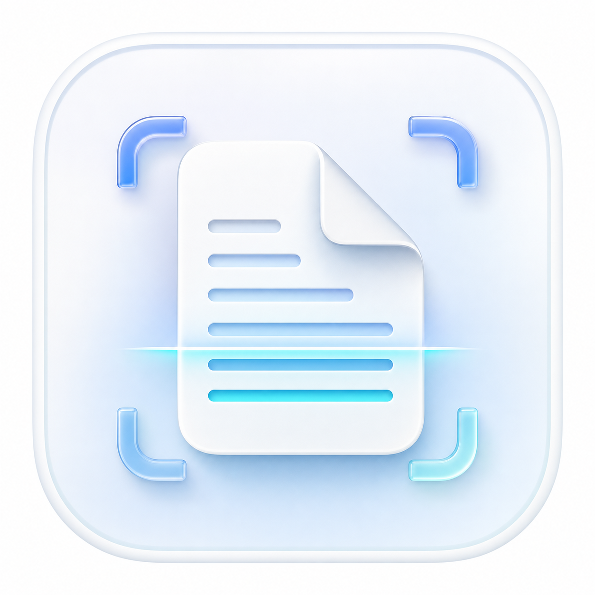
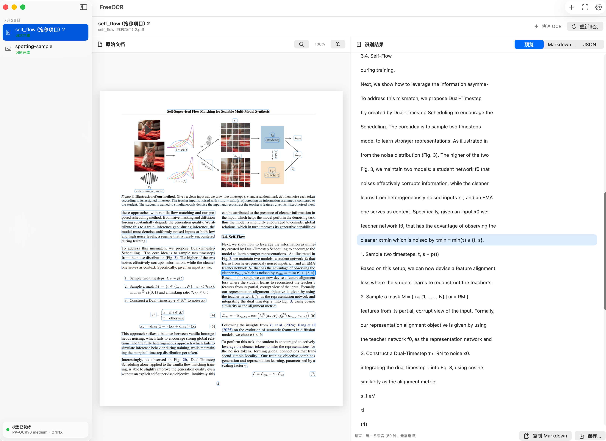

  

<h1 align="center">FreeOCR for macOS</h1>

Apple Silicon용 빠르고 비공개이며 완전히 로컬인 OCR.

  <a href="../README.md">English</a> ·
  <a href="README.zh-CN.md">简体中文</a> ·
  <a href="README.ja.md">日本語</a> ·
  <strong>한국어</strong> ·
  <a href="README.de.md">Deutsch</a> ·
  <a href="README.fr.md">Français</a> ·
  <a href="README.ru.md">Русский</a> ·
  <a href="README.es.md">Español</a>

  
  
  
  

> 현재 버전: **1.1.5** · **macOS 26.0 이상**과 **Apple Silicon Mac**이
> 필요합니다. 앱 UI는 영어와 중국어 간체만 지원합니다.

FreeOCR은 SwiftUI 기반 네이티브 macOS 앱입니다. PP-OCRv6 medium 텍스트
검출 및 인식 ONNX 모델을 포함하므로 계정, 추가 모델 다운로드, 문서 업로드
없이 오프라인으로 작동합니다.

## 주요 기능

- PDF, PNG, JPEG, HEIC/HEIF, TIFF, BMP, GIF, WebP OCR.
- Finder 또는 웹 페이지에서 드래그 앤 드롭.
- 원본 영역과 인식 텍스트 사이의 양방향 하이라이트.
- 여러 페이지 미리보기, 확대/축소, 실제 진행률, 날짜별 영구 기록.
- 미리보기, Markdown, 구조화된 JSON 복사 및 저장.
- 통합 50개 언어 인식 모델로 언어 선택이 필요하지 않음.
- 로컬 REST API, 선택적 LAN 접근 및 Bearer Token.
- 빨간 닫기 버튼은 창만 닫고 앱과 API는 계속 실행합니다. Dock 아이콘으로
  창을 다시 열고, Dock 또는 앱 메뉴의 종료를 사용해 완전히 종료합니다.

## 요구 사항 및 설치

- macOS 26.0 이상.
- M1/M2/M3/M4 이상의 Apple Silicon. Intel Mac은 지원하지 않습니다.
- 약 900MB 디스크 공간, 최소 8GB RAM(16GB 권장).

GitHub Releases에서 `FreeOCR-1.1.5-arm64.dmg`를 내려받아 앱을
Applications로 드래그하세요. 현재 빌드는 ad-hoc 서명이며 Apple 공증을 받지
않았습니다. 첫 실행 시 Control-클릭 후 **열기**를 선택해야 할 수 있습니다.

앱 크기의 대부분은 완전한 오프라인 런타임입니다. 모델은 약 133MB,
Python/OCR 런타임은 약 685MB이며 PaddleOCR, PaddleX, ONNX Runtime,
OpenCV, PDFium, FastAPI와 종속성을 포함합니다.

## 데이터, API, 라이선스

기록은 사용자별 `~/Documents/FreeOCR`에 저장됩니다. 문서는 로컬에서만
처리되며 분석 또는 업로드 서비스가 없습니다. API 기본 주소는
`http://127.0.0.1:8766`입니다. LAN 접근을 켤 때는 강력한 Bearer Token을
설정하세요.

소스 배포물에는 모델과 Python 런타임이 포함되지 않습니다.

- [PP-OCRv6 medium DET ONNX](https://huggingface.co/PaddlePaddle/PP-OCRv6_medium_det_onnx)
- [PP-OCRv6 medium REC ONNX](https://huggingface.co/PaddlePaddle/PP-OCRv6_medium_rec_onnx)

두 모델 페이지에는 Apache License 2.0으로 표시되어 있습니다. 자세한 내용은
[`THIRD_PARTY_NOTICES.md`](../THIRD_PARTY_NOTICES.md)를 참조하세요.

FreeOCR 원본 코드는
[PolyForm Noncommercial License 1.0.0](../LICENSE)으로 제공되며 상업적
사용은 금지됩니다. 상업적 제한 때문에 OSI 승인 오픈 소스가 아닌
source-available 라이선스입니다.

1.1.5는 macOS 26.5.2, M1 Pro 8코어, 16GB RAM, Swift 6.3.3,
arm64 Python 3.10.16 환경에서 테스트했습니다.
