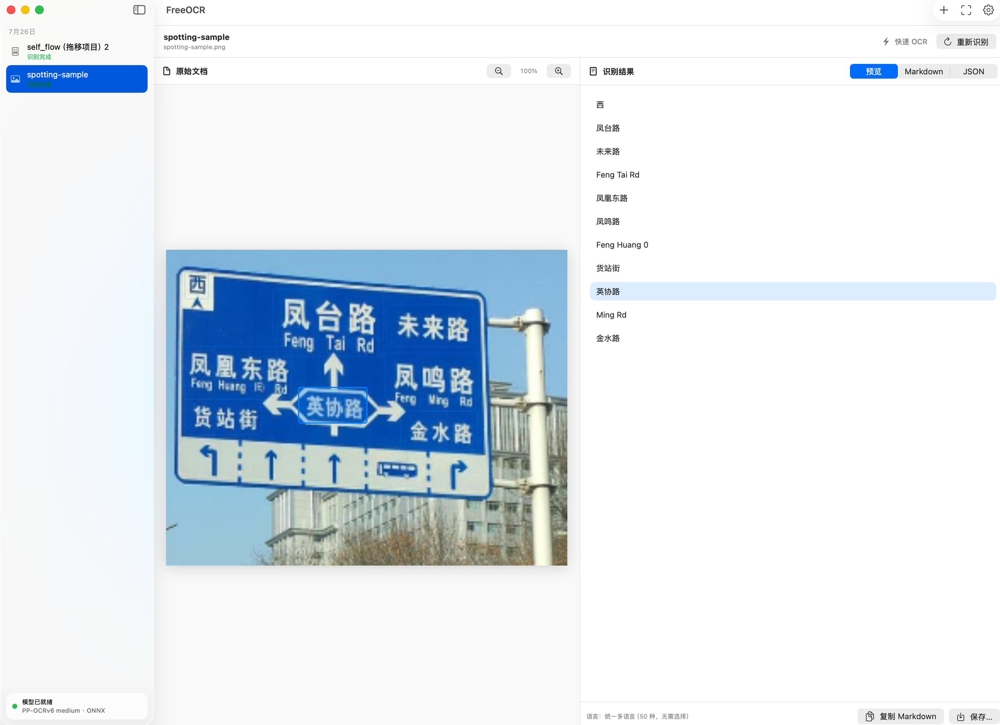
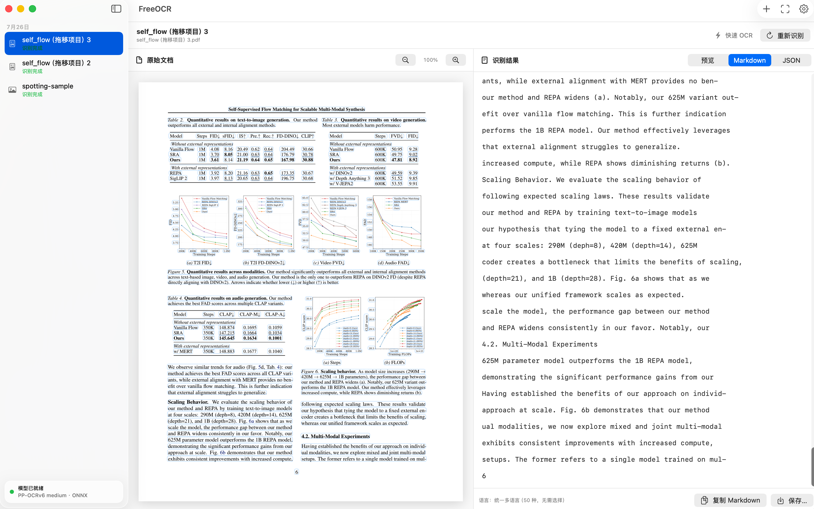
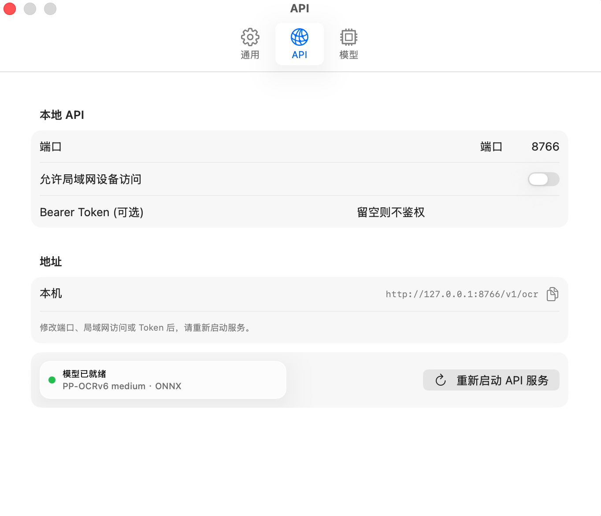
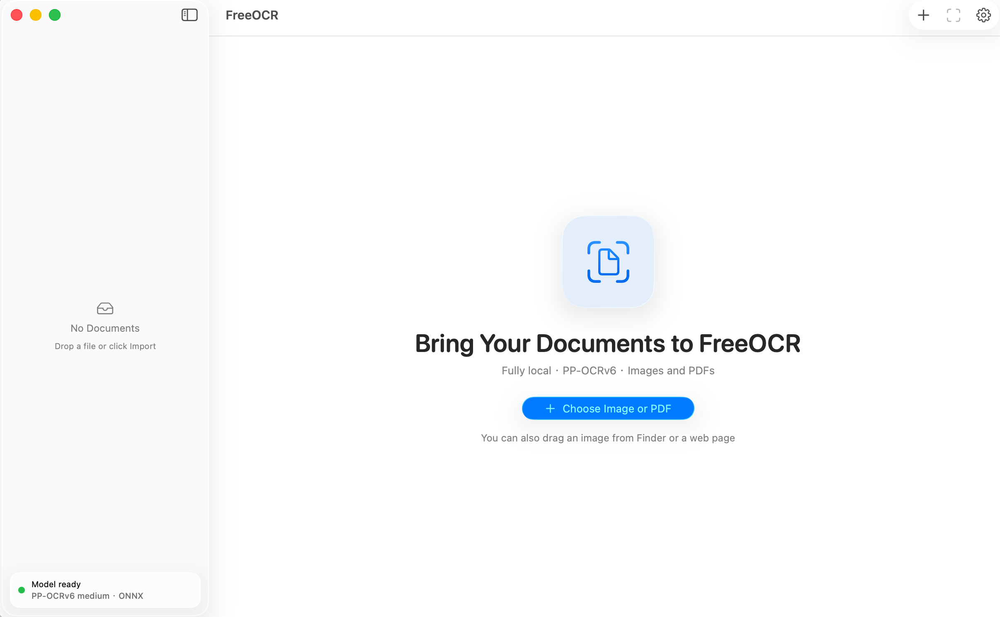

<p align="center">
  
</p>

<h1 align="center">FreeOCR for macOS</h1>

<p align="center">面向 Apple Silicon 的快速、隐私、完全本地 OCR。</p>

<p align="center">
  <a href="../README.md">English</a> ·
  <strong>简体中文</strong> ·
  <a href="README.ja.md">日本語</a> ·
  <a href="README.ko.md">한국어</a> ·
  <a href="README.de.md">Deutsch</a> ·
  <a href="README.fr.md">Français</a> ·
  <a href="README.ru.md">Русский</a> ·
  <a href="README.es.md">Español</a>
</p>

<p align="center">
  <a href="https://github.com/ScorpioDai/FreeOCR/releases/tag/v1.1.5"></a>
  
  
  <a href="../LICENSE"></a>
</p>

> 当前版本：**1.1.5** · 需要 **macOS 26.0 或以上**和
> **Apple Silicon Mac**。程序界面仅支持英文和简体中文。

FreeOCR 是原生 SwiftUI 桌面 App，内置 PP-OCRv6 medium 文本检测与识别
ONNX 模型。安装后可以完全离线使用，不需要账户、下载模型或上传文档。


## 主要功能

- 识别 PDF、PNG、JPEG、HEIC/HEIF、TIFF、BMP、GIF 和 WebP。
- 从 Finder 拖放文件，也可以从网页直接拖入图片。
- 原文区域与识别文字双向定位和高亮。
- 多页预览、缩放、真实任务进度和按日期分组的持久化历史记录。
- 预览、Markdown、结构化 JSON 输出、复制和 macOS 原生保存面板。
- 统一 50 语言识别模型，不需要用户选择语言。
- 设置中即时切换英文和简体中文界面。
- 本机 REST API，可选局域网访问和 Bearer Token。
- 点击红色关闭按钮只关闭窗口，不退出 FreeOCR 或 API；点击 Dock 图标可重新
  打开窗口，使用 Dock 或程序菜单的“退出”才会真正结束程序。

## 截图

| 多语言图片 OCR | Markdown 输出 |
| --- | --- |
|  |  |

| 本地 API 设置 | 英文欢迎界面 |
| --- | --- |
|  |  |

## 系统要求与体积

- macOS 26.0 或以上。
- M1、M2、M3、M4 或更新的 Apple Silicon；不支持 Intel Mac。
- 当前 App 约需 900MB 磁盘空间。
- 最低 8GB 内存，处理大型多页 PDF 建议 16GB 或以上。

当前 App 约 832MB（优化前构建约 889MB），因为它是可以离线搬运的完整运行包。
两个 ONNX 模型仓库约 133MB；便携 Python/OCR 环境约 685MB，其中包含 PaddleOCR、PaddleX、
ONNX Runtime、OpenCV、PDFium、FastAPI 及其传递依赖。运行环境是体积的
主要来源。

## 安装

1. 从 GitHub Releases 下载 `FreeOCR-1.1.5-arm64.dmg`。
2. 打开 DMG，把 `FreeOCR.app` 拖到“应用程序”。
3. 启动后等待左下角状态灯变绿，再导入或拖入文档。

当前社区构建使用 ad-hoc 签名，尚未经过 Apple 公证。第一次启动时，macOS
可能要求按住 Control 点击 App、选择“打开”并确认。请只从本仓库下载发行文件。

## 输出、历史与隐私

- 在“预览”和“Markdown”选项卡中，复制和保存的是 Markdown。
- 在“JSON”选项卡中，复制和保存的是当前显示的 JSON。

历史记录按本机当前用户保存在：

```text
~/Documents/FreeOCR
```

每条历史包含原始文件、页面预览、Markdown、JSON 和元数据。文档和识别结果
只在这台 Mac 上处理，FreeOCR 不包含分析统计或上传服务。

## 本地 API

默认地址为 `http://127.0.0.1:8766`。可在设置中修改端口、开启局域网访问和
配置可选 Bearer Token。不要在不可信网络上无 Token 开启局域网访问。

```bash
curl http://127.0.0.1:8766/health
curl -X POST http://127.0.0.1:8766/v1/ocr \
  -F 'file=@/path/to/document.pdf' \
  -F 'response_format=markdown'
```

完整接口见 [`API_USAGE.zh-CN.md`](API_USAGE.zh-CN.md)。

## 从源码构建

Git 仓库和源码 ZIP 不包含模型、便携 Python 环境和构建产物。请完整下载：

- [PP-OCRv6 medium DET ONNX](https://huggingface.co/PaddlePaddle/PP-OCRv6_medium_det_onnx)
- [PP-OCRv6 medium REC ONNX](https://huggingface.co/PaddlePaddle/PP-OCRv6_medium_rec_onnx)

```bash
python3 -m venv Runtime/.venv
Runtime/.venv/bin/python -m pip install -r Runtime/requirements-lock.txt

export FREEOCR_DETECTION_MODEL_PATH="/模型路径/PP-OCRv6_medium_det_onnx"
export FREEOCR_RECOGNITION_MODEL_PATH="/模型路径/PP-OCRv6_medium_rec_onnx"

swift build
Runtime/.venv/bin/python -m unittest discover -s Runtime -p 'test_*.py'
./script/package_release.sh
```

脚本会在 `release/` 中生成自包含 App、App ZIP、源码 ZIP 和压缩 DMG。

## 测试环境

1.1.5 在 macOS 26.5.2（Build 25F84）、M1 Pro 8 核、16GB 内存的
MacBook Pro 上构建和测试；工具链为 Swift 6.3.3、arm64 Python 3.10.16、
PaddleOCR 3.7.0、PaddleX 3.7.2 和 ONNX Runtime 1.23.2。

## 模型与许可证

内置的 DET 与 REC 模型来自 PaddlePaddle 官方 Hugging Face 仓库，上述两个
模型页面均标注 Apache License 2.0。模型和第三方组件继续受各自许可证约束，
详见 [`THIRD_PARTY_NOTICES.md`](../THIRD_PARTY_NOTICES.md)。

FreeOCR 原创源码采用
[PolyForm Noncommercial License 1.0.0](../LICENSE)，仅允许其条款规定的
非商业使用、学习、研究、修改和分发，禁止商用。因为包含非商业限制，该许可
不是 OSI 认可的开源许可；更准确的说法是“源码可用”。
